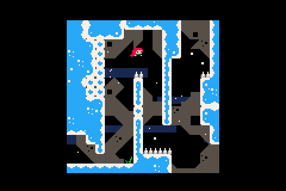

# Mod of the original version, see [here](https://github.com/JeffRuLz/Celeste-Classic-GBA)
# This only goes to the memorial (1200 m) for the moment, i'm editing it.
## some in-game screenshots:

### the original game has 31 screens, this one will probably have the same amount but the orb will be a bit lower. 

## == Celeste Classic GBA port ==
## original description

This is a port of Celeste Classic to the Game Boy Advance.

It's almost a direct conversion with minor graphical alterations.

### original game credits:

Matt Thorson - design and audio

mattmakesgames.com

Noel Berry - code and art

noelfb.com

### Play the original game and view its source here:

lexaloffle.com/bbs/?tid=2145

## Building

Install [devkitPro](https://devkitpro.org/wiki/Getting_Started) and select "GBA Development" during installation. Then run "make" in a command prompt.
